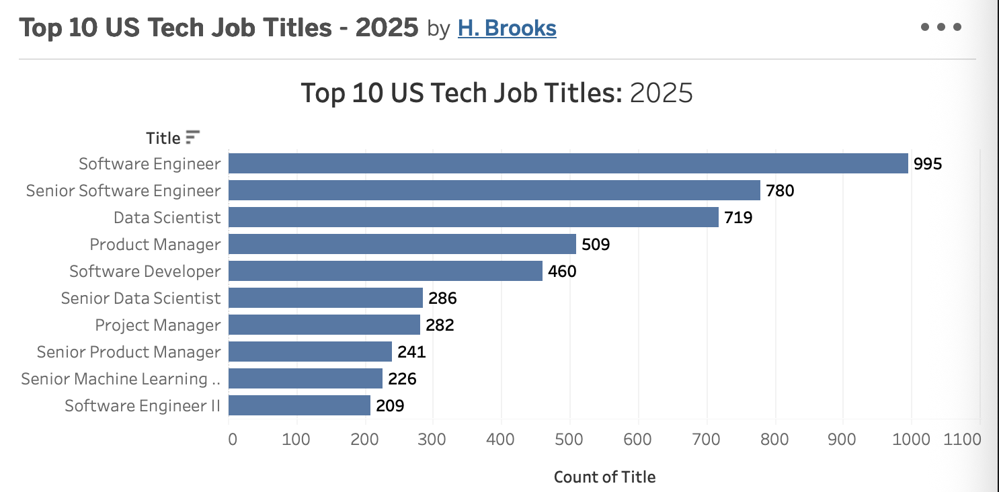

### U.S. Tech Job Market Data Exploration 

This project analyzes a large dataset of US tech career listings to uncover trends, in-demand titles, common tech career types, and top hiring locations.
The goal is to showcase practical data cleaning, exploration, and visualization skills using Python and Tableau. 

---

## Tableau Visualization: Top 10 U.S. Tech Job Titles (2025)

Click the image above to view the full interactive chart on Tableau Public.

The interactive chart on Tableau Pubic highlights the 10 most frequently posted tech job titles in the U.S. during 2025. 

---

## Python Visualization: Top Tech Job Titles (2025)

This Python bar chart complements the Tableau visual by showing US states that host the most tech career opportunities. California leads the market, followed by Texas, Virginia, Washington, and New York. This affirms where the strongest hiring activity is located across the country. 

---

## Project Structure

- `sample_all_jobs.xlsx` – Sample of original dataset (500 rows for GitHub)
- `US_Tech_Job_Analysis.ipynb` – Jupyter Notebook with full analysis
- `TopTechJobTitles.twbx` - Tableau packaged workbook with interactive job
   title dashboard. 
- Visualizations embedded inline.
- `top_10_titles.png`- Image of top 10 in list.
- `all_tech_job_titles.png` - All listed titles. 

---

## Tools & Libraries Used

-  Python (JupyterLab)
- `pandas`, `numpy` – Data manipulation & exploration
- `matplotlib`, `seaborn` – Visualizations 
- `openpyxl` – Excel file support for `.xlsx` import 

---

## Key Questions Answered

1. Which companies are hiring the most? 
2. What job titles are most in demand? 
3. Which U.S. cities or states have the highest tech job openings?
4. What types of job contracts are common? (e.g., full-time, contract, internship)

---

### Highlighted Insights

## Top Hiring Companies
Bar chart of top 10 companies with the most postings (e.g., Amazon, JPMorgan Chase, Google).

## Most Common Job Titles
Roles like Software Engineer, Data Scientist, and Product Manager dominate listings.  

## Top Hiring Locations
Remote jobs lead the market, followed by hubs like New York, Seattle, and San Francisco.

## Job Type Distribution
Full-time roles are most common, but contract and internship opportunities are also significant.

---

### Notable Features

- Cleaned and explored ~94,000+ job listings. 
- Applied `.value_counts()`, filtering, and sorting. 
- Clear, accessible horizontal bar charts. 
- Markdown commentary throughout for interpretation. 
- Removed incomplete location data for more accurate visuals. 
- Combined Python and Tableau visual storytelling. 

---

### Skills Demonstrated

- Exploratory Data Analysis 
- Data cleaning 
- Data visualization and storytelling
- Markdown documentation/structure

---

### Target Audience

This project is designed to showcase entry-level data analysis skills. 

---

## Next Steps

Planned Enhancements:
- Time-series trend analysis using `date_posted`. 
- Comparisons between remote vs. on-site postings. 
- Export visualizations as static PNGs for portfolios. 

---

## Data Source

This dataset was originally sourced from [Kaggle](https://www.kaggle.com/). 
Job listing data sourced from publicly available job boards and educational datasets. Sample extracted & cleaned for demonstration purposes. 

---

## Author

Hallene Brooks 
GitHub: [HCBrooks-lab](https://github.com/HCBrooks-lab)
