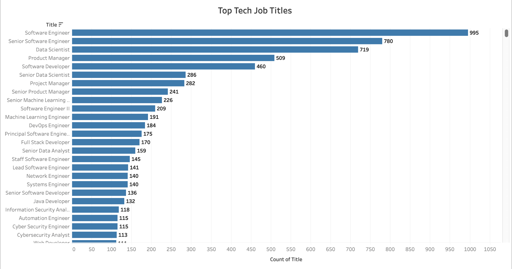

# U.S. Tech Job Market Data Exploration 

This project analyzes a large dataset of U.S. tech job listings to uncover hiring trends, in-demand job titles, common job types, top locations, and salary distribution. The goal is to showcase practical skills in data cleaning, analysis, and visualization using Python.

---

## Tableau Visualization

Click the image above to view the full interactive chart on Tableau Public.

This interactive bar chart displays the **Top Tech Job Titles** based on their frequency across U.S. tech job listings.

It highlights in-demand roles such as Software Engineer, Data Scientist, and Product Manager using data visualized in Tableau Public.

---

## Project Structure

- `sample_all_jobs.xlsx` – Sample of original dataset (500 rows for GitHub)
- `US_Tech_Job_Analysis.ipynb` – Jupyter Notebook with full analysis 
- Visualizations embedded inline (matplotlib & seaborn)

---

## Tools & Libraries Used

-  Python (JupyterLab)
- `pandas`, `numpy` – Data manipulation & exploration
- `matplotlib`, `seaborn` – Visualizations 
- `openpyxl` – Excel file support for `.xlsx` import 

---

## Key Questions Answered

1. Which companies are hiring the most? 
2. What job titles are most in demand? 
3. Which U.S. cities or states have the highest tech job openings?
4. What types of job contracts are common? (e.g., full-time, contract, internship)
5. What is the salary range distribution across postings?

---

## Highlighted Insights

### Top Hiring Companies
Bar chart of top 10 companies with the most postings (e.g., Amazon, JPMorgan Chase, Google).

### Most Common Job Titles
Roles like Software Engineer, Data Scientist, and Product Manager dominate listings.  

### Top Hiring Locations
Remote jobs lead the market, followed by hubs like New York, Seattle, and San Francisco.

### Job Types Distribution
Full-time roles are most common, but contract and internship opportunities are also significant.

### Salary Range Distribution
Visual distribution of minimum and maximum salaries. Outliers above $500,000 are excluded for clarity.

---

## Notable Features

- Cleaned and explored ~94,000+ job listings
- Applied `.value_counts()`, filtering, and sorting
- Filtered salary outliers for realistic insights (`< $500,000`)
- Clear, accessible horizontal bar charts
- Markdown commentary throughout for interpretation

---

## Skills Demonstrated

- Exploratory Data Analysis (EDA)
- Data cleaning (null values, outliers)
- Data visualization best practices
- Markdown storytelling and documentation

---

## Target Audience

This notebook is tailored to showcase **entry-level data analysis skills** to hiring managers, recruiters, and collaborators evaluating junior data professionals.

---

## Next Steps

Planned Enhancements:
- Time-series trend analysis using `date_posted`
- Salary comparisons between remote vs. on-site roles
- Export visualizations as static PNGs for portfolios

---

## Author

Hallene Brooks 
GitHub: [HCBrooks-lab](https://github.com/HCBrooks-lab)
